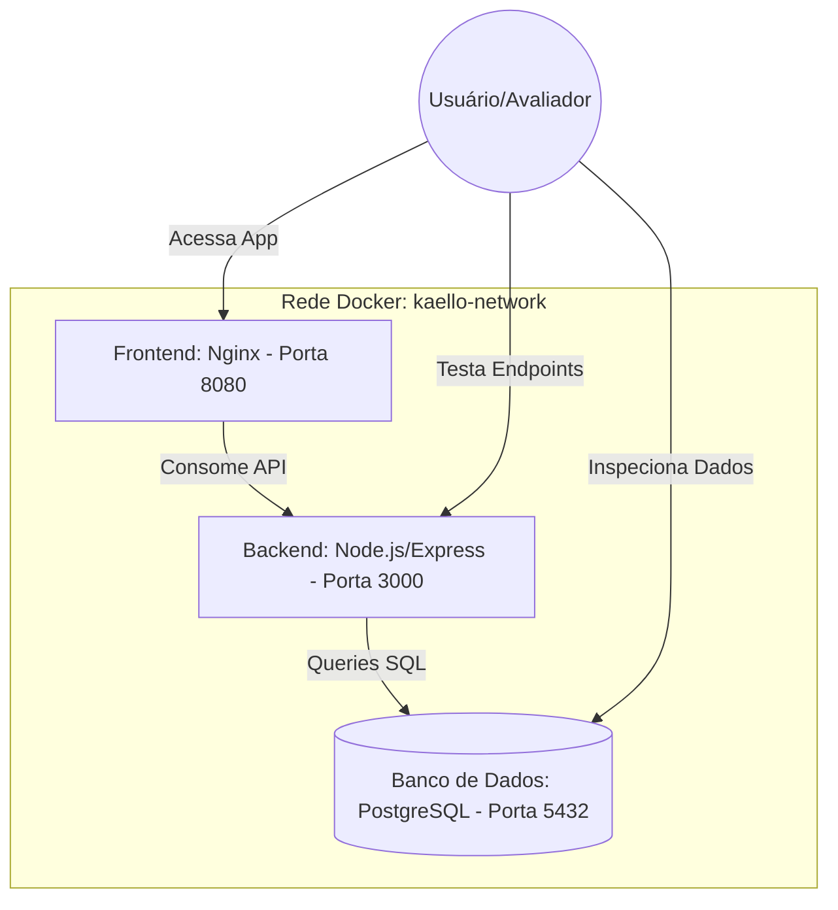

# Kaello ERP Comercial · Gestão de Orçamentos e Faturamento

Este repositório contém a resolução completa do **Desafio Técnico Inicial para a vaga de Estágio Full Stack** (Suporte & Produto) da **redegess**.

O projeto foi inteiramente estruturado seguindo as melhores práticas de desenvolvimento, com **ambientes conteinerizados via Docker e Docker Compose**, simulando um ambiente real de produção com banco de dados **PostgreSQL**, **Node.js** e **React (Vite)** rodando em rede privada e servido por **Nginx**.

---

## 🐋 Por que Docker? (Melhores Práticas)

Utilizar o Docker para este desafio traz vantagens críticas que simulam o fluxo profissional do dia a dia no time de tecnologia:
1. **Isolamento de Ambiente**: Garante que o projeto execute da mesma forma em qualquer sistema operacional (Windows, macOS ou Linux), sem a necessidade de instalar bancos de dados ou runtimes Node.js localmente na máquina ("*Funciona na minha máquina*").
2. **Banco de Dados Real e Triggers**: Em vez de usar mock temporário em memória, rodamos uma instância real do **PostgreSQL 15** em container, permitindo testar fisicamente os Triggers de banco que calculam e recalculam os subtotais e totais de orçamentos diretamente nas tabelas.
3. **Servidor Web de Produção (Nginx)**: O frontend em React não roda em servidor de desenvolvimento instável. Ele é compilado em produção (Multi-stage build) e servido diretamente pelo **Nginx**, refletindo a usabilidade final real e mitigando problemas de caching.
4. **Orquestração Rápida**: Com apenas um comando, toda a arquitetura de banco de dados, backend e frontend é erguida de forma encadeada na ordem correta de inicialização.

---

## 🏗️ Arquitetura do Docker Compose

O arquivo `docker-compose.yml` na raiz gerencia três serviços principais dentro de uma rede virtual bridge chamada `kaello-network`:



1. **`db` (kaello_postgres_db)**:
   - Base de dados PostgreSQL 15.
   - Script SQL `database/init.sql` montado na pasta especial `/docker-entrypoint-initdb.d/` para executar as tabelas, triggers e dados iniciais automaticamente no primeiro boot.
   - Porta exposta: `5432` (para conexões externas de ferramentas como DBeaver ou pgAdmin).
2. **`backend` (kaello_backend_api)**:
   - Executa a API Node.js.
   - Dockerfile baseado em `node:20-alpine`.
   - Conecta-se ao serviço `db` utilizando variáveis de ambiente de rede interna.
   - Implementa uma **lógica de retry inteligente** no `server-api.js` que monitora a inicialização do Postgres para evitar que a API quebre durante o boot inicial do banco.
3. **`frontend` (kaello_frontend_nginx)**:
   - Dockerfile de dois estágios (Multi-stage Build).
   - Estágio 1 (Builder): Instala dependências do React e compila o bundle de produção via Vite (`npm run build`).
   - Estágio 2 (Runner): Transfere os arquivos gerados em `/dist` para a pasta pública do servidor **Nginx** e copia a configuração de rotas `nginx.conf`.
   - Porta exposta: `8080`.

---

## 📂 Estrutura do Projeto Reorganizada

```bash
├── respostas-desafio.md       # Relatório respondendo às Situações 1, 2 e 3 (focado em Docker)
├── sistema-com-bugs.html      # Arquivo original legado contendo as falhas relatadas
├── sistema-corrigido.html     # Versão legada corrigida e segura com toasts CSS
├── docker-compose.yml         # Orquestrador dos containers (Postgres, API, Nginx)
├── database/
│   └── init.sql               # Script SQL de modelagem do banco montado no container Postgres
├── backend/
│   ├── Dockerfile             # Dockerfile para o container Node.js
│   ├── package.json           # Dependências da API (express, cors, pg)
│   └── server-api.js          # API REST Node.js integrada ao banco Postgres
└── frontend/
    ├── Dockerfile             # Dockerfile multi-stage com Nginx
    ├── nginx.conf             # Configuração do Nginx para suportar SPA React
    ├── package.json
    ├── src/
    │   ├── App.tsx            # Lógica comercial, autocomplete, toasts e simulações
    │   └── index.css          # Design system premium e responsivo
    └── vite.config.ts
```

---

## ⚙️ Como Executar a Aplicação com Docker

Certifique-se de ter o **Docker** e o **Docker Compose** instalados na sua máquina.

### 1. Clonar e Inicializar os Containers
No diretório raiz do projeto, execute o comando para baixar as imagens oficiais, construir as imagens locais e iniciar os serviços:

```bash
# 1. Constrói e inicializa os containers em segundo plano (detached)
docker-compose up --build -d
```

### 2. Verificar os Status dos Serviços
Você pode monitorar os containers e conferir se todos estão saudáveis executando:

```bash
# Lista os containers em execução e suas portas
docker-compose ps
```

### 3. Acessar as Interfaces
* **Frontend (React ERP)**: Acesse no navegador em **`http://localhost:8080`**.
* **Backend (API REST)**: Disponível para testes de endpoints em **`http://localhost:3000`** (ex: `http://localhost:3000/api/produtos` para conferir o autocomplete).
* **Banco de Dados (PostgreSQL)**: Disponível em `localhost:5432` com usuário `postgres` e senha `postgres`.

### 4. Monitoramento e Logs (Muito Útil para o Chamado #2087)
Para analisar os logs do servidor em tempo real (como por exemplo, ao simular a falha da Fernanda da Alfa Serviços):

```bash
# Visualizar logs consolidados de todos os containers
docker-compose logs -f

# Visualizar logs apenas da API Backend
docker-compose logs -f backend

# Visualizar logs apenas do Banco de Dados Postgres
docker-compose logs -f db
```

### 5. Finalizar os Serviços
Para desligar os containers e liberar as portas do computador:

```bash
# Para os containers e remove a rede interna criada
docker-compose down
```

---

## 🧪 Como Testar a Simulação da "Tela Branca" (Chamado #2087)

Graças ao ambiente Docker, você pode depurar visualmente a **Situação 1** do desafio na tela do frontend React (`http://localhost:8080`):
1. **Ative a Falha**: No painel de debug no rodapé do React, desmarque a caixa *"Tratamento de Erros Seguro"*.
2. **Execute o Faturamento**: Selecione o cliente **Alfa Serviços** (ID correspondente ao orçamento #3 no banco Postgres) e clique em **Faturar Orçamento**.
3. **Veja o Comportamento**:
   - A API backend simula o deadlock de banco de dados e retorna o erro HTTP `500`.
   - Sem tratamento de exceção no React (safe mode desligado), o script do frontend tenta acessar propriedades nulas e trava completamente, resultando na **Tela Branca** reportada pela Fernanda.
   - Você pode conferir a quebra de transação executando `docker-compose logs backend` no terminal para verificar o stack trace do erro 500 simulado no backend.

---

**Desenvolvido por [Jorgyvan Lima](https://github.com/jorgyvanlima)**  
*Desafio Técnico · redegess*
